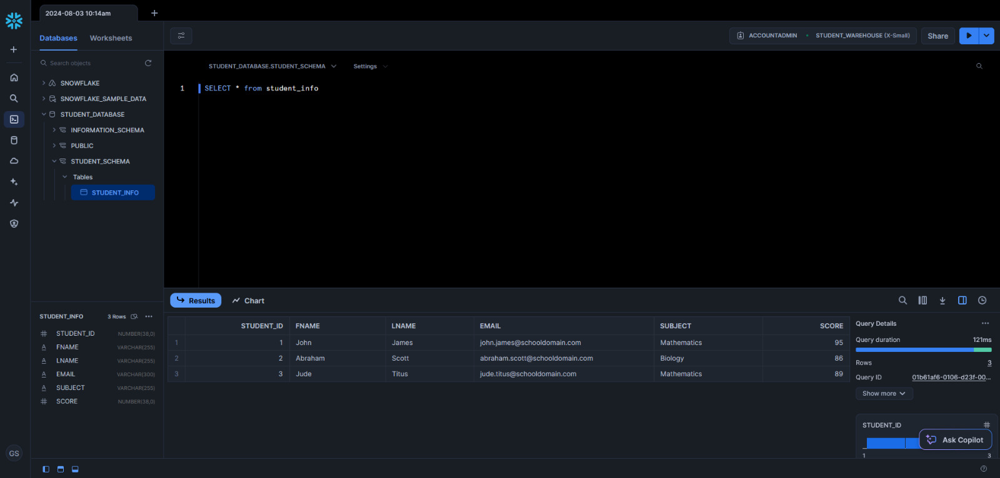

# Data Ingestion with Airflow on AWS and Snowflake

## Overview

This project demonstrates the use of an EC2 instance on AWS to deploy Apache Airflow, which orchestrates a simple Directed Acyclic Graph (DAG). The DAG is responsible for creating and inserting data into a Snowflake table.

## Table of Contents

1. [Prerequisites](#prerequisites)
2. [Architecture](#architecture)
3. [Setup Instructions](#setup-instructions)
4. [Airflow DAG](#airflow-dag)
5. [Snowflake Configuration](#snowflake-configuration)
6. [Running the Project](#running-the-project)
7. [Conclusion](#conclusion)
8. [Acknowledgments](#acknowledgments)
9. [References](#references)

## Prerequisites

- AWS Account
- Snowflake Account
- Basic understanding of EC2, Apache Airflow, and Snowflake

## Architecture

1. **AWS EC2 Instance**: Hosts the Airflow environment.
2. **Apache Airflow**: Manages the workflow (DAG).
3. **Snowflake**: Cloud data warehouse where the data is stored.

## Setup Instructions

### 1. Launch an EC2 Instance

- **Step 1**: Log in to your AWS account.
- **Step 2**: Navigate to the EC2 Dashboard and launch an instance.
- **Step 3**: Choose an AMI (Amazon Machine Image) (Ubuntu 24.04).
- **Step 4**: Select an instance type (t2.medium).
- **Step 5**: Configure security groups to allow SSH access and necessary ports for Airflow (port 8080).
- **Step 6**: Launch the instance and connect via SSH.

### 2. Install dependencies

- **Step 1**: Update package lists:
  ```sh
  sudo apt-get update
  ```
- **Step 2**: Install pip for Python 3:
  ```sh
  sudo apt install python3-pip
  ```
- **Step 3**: Install Python 3.12 virtual environment package:
  ```sh
  sudo apt install python3.12-venv
  ```
- **Step 4**: Create a virtual environment:
  ```sh
  python3 -m venv airflow_snow_venv
  ```
- **Step 5**: Activate the virtual environment:
  ```sh
  source airflow_snow_venv/bin/activate
  ```
- **Step 6**: Set the appropriate permissions:
  ```sh
  sudo chmod -R a+rwx airflow_snow_venv
  ```
- **Step 7**: Install Apache Airflow:
  ```sh
  airflow_snow_venv/bin/pip install apache-airflow
  ```
- **Step 8**: Install Snowflake providers and connectors:
  ```sh
  airflow_snow_venv/bin/pip install apache-airflow-providers-snowflake snowflake-connector-python apache-snowflake-sqlalchemy
  ```
- **Step 9**: Initialize Airflow in standalone mode:
  ```sh
  airflow standalone
  ```

### 3. Configure Snowflake

- **Step 1**: Create a database and schema in Snowflake.
- **Step 2**: Create a user and role with appropriate permissions.
- **Step 3**: Create a warehouse to run queries.

## Airflow DAG

### DAG Definition

The DAG is defined to:

1. Create a table in Snowflake.
2. Insert data into the created table.


## Snowflake Configuration

### Snowflake Connection in Airflow

- **Step 1**: Go to the Airflow UI (http://<EC2_PUBLIC_IP>:8080).
- **Step 2**: Navigate to Admin > Connections.
- **Step 3**: Create a new connection with:
  - **Conn Id**: my_snowflake_conn
  - **Conn Type**: Snowflake
  - **Host**: <your_snowflake_account>.snowflakecomputing.com
  - **Login**: <your_username>
  - **Password**: <your_password>
  - **Schema**: <your_schema>
  - **Database**: <your_database>
  - **Warehouse**: <your_warehouse>

## Running the Project

1. Ensure the EC2 instance is running and you can SSH into it.
2. Ensure Airflow web server and scheduler are running.
3. Access the Airflow UI and trigger the DAG manually or wait for the scheduled interval.



## Conclusion

This project illustrates a basic ETL workflow using Apache Airflow on an AWS EC2 instance, targeting a Snowflake data warehouse. It can be extended to include more complex tasks and dependencies as needed.

## Acknowledgments

This project was developed by following tuplespectra's tutorial on Youtube.

## References

- [AWS EC2 Documentation](https://docs.aws.amazon.com/ec2/)
- [Apache Airflow Documentation](https://airflow.apache.org/docs/)
- [Snowflake Documentation](https://docs.snowflake.com/)
